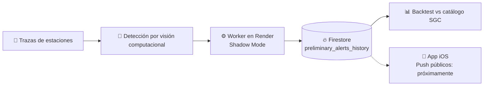

<!-- Banner -->
<h1 align="center">
  
</h1>

  

  
  
  

---

## 👨💻 Sobre mí

- 🌎 Desarrollador desde Colombia, enfocado en **apps móviles nativas** y **sistemas backend en tiempo real**.
- 🌋 Actualmente construyo **SismoAlerta**: un sistema de alertas sísmicas para Colombia que detecta eventos con **visión computacional sobre trazas de ondas** de estaciones sismológicas.
- 🎯 Mi foco ahora: **subir la precisión** del detector antes de habilitar notificaciones push públicas.
- 📊 Valido cada alerta contra el **catálogo oficial del SGC** (backtesting con verdaderos positivos y falsos negativos).
- 🌱 Aprendiendo: _(agrega aquí lo que estés estudiando)_
- 📫 Contacto: _(tu correo o LinkedIn)_

---

## ⭐ Proyecto destacado: SismoAlerta

> Sistema de alerta sísmica para Colombia, con app iOS, backend y un worker de detección en producción.

| Componente | Descripción | Tecnologías |
|---|---|---|
| 📱 [SismoAlerta](https://github.com/jeancarlo12/SismoAlerta) | App iOS para alertas sísmicas |  |
| ⚙️ [SismoAlerta-Backend](https://github.com/jeancarlo12/SismoAlerta-Backend) | API, worker de detección y herramientas de backtesting |    |

---

## 🚀 Más proyectos

| Proyecto | Descripción | Stack |
|---|---|---|
| 📱 [LUKA](https://github.com/jeancarlo12/LUKA) | _(una línea: qué hace y para quién)_ |  |
| 🌐 [Portafolio-Jeancarlo](https://github.com/jeancarlo12/Portafolio-Jeancarlo) | Mi portafolio personal | _(tu stack web)_ |
| 🧩 [Be-Master](https://github.com/jeancarlo12/Be-Master) | _(una línea: qué hace)_ | _(stack)_ |

---

## 🛠️ Stack tecnológico

  

| Área | Herramientas |
|---|---|
| **Móvil** | Swift (iOS), Kotlin (Android) |
| **Backend** | Node.js, Firestore, workers en Render |
| **Datos y validación** | Backtesting con scripts en Node.js, análisis con CSV |
| **Herramientas** | Git, GitHub, integración de APIs, agentes de IA para programar |

---

## 📈 Estadísticas de GitHub

  
  

  

---

## 🤝 Conectemos

  
  
  

