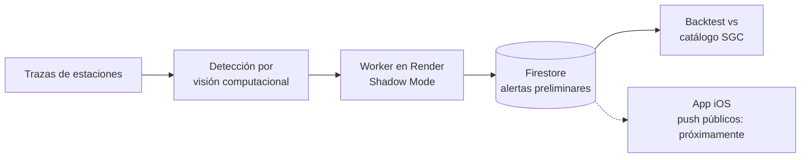

<h1 align="center">Jeancarlo Alzate Ramírez</h1>

  Desarrollador de software · Apps móviles nativas y sistemas backend en tiempo real 
  Colombia

  
  
  

---

## Perfil

Desarrollo aplicaciones móviles en **Swift** y **Kotlin** y servicios backend en **Node.js**. Mi proyecto principal es **SismoAlerta**, un sistema de alerta sísmica para Colombia que detecta eventos mediante **visión computacional sobre trazas de ondas** de estaciones sismológicas y contrasta sus resultados con el catálogo oficial del Servicio Geológico Colombiano (SGC).

Actualmente profundizo en arquitectura de software y despliegues en la nube.

---

## Caso de estudio: SismoAlerta

Sistema de alerta sísmica para Colombia: app iOS, backend y worker de detección en producción. *(Código en repositorios privados; el detalle está en mi [portafolio](https://www.jeancarlo.space/es).)*

**Estado actual:** el detector opera en *Shadow Mode*: genera y registra alertas sin notificar al público. El objetivo es aumentar la precisión antes de habilitar notificaciones push.

**Decisiones de ingeniería**
- **Validación con datos:** cada alerta se compara con el catálogo SGC, separando verdaderos positivos y falsos negativos, para medir el detector y no depender de impresiones.
- **Despliegue en modo sombra:** permite evaluar el sistema en producción sin exponer a usuarios a falsas alarmas.
- **Historial persistente** de alertas preliminares para auditoría y análisis posterior.

**Stack:** Swift · Node.js · Firestore · Render

---

## Otros proyectos

| Proyecto | Descripción | Tecnologías |
|---|---|---|
| [LUKA](https://github.com/jeancarlo12/LUKA) | Proyecto universitario: simulación de una aplicación bancaria móvil | Kotlin · Android |
| [Portafolio](https://www.jeancarlo.space/es) | Mi portafolio personal | Web |

---

## Stack

| Área | Tecnologías |
|---|---|
| Móvil | Swift (iOS) · Kotlin (Android) |
| Backend | Node.js · Firestore · Render |
| Calidad de datos | Backtesting propio, análisis con CSV |
| Herramientas | Git · GitHub · Integración de APIs |

  

---

Abierto a colaboración en proyectos de alerta temprana, apps móviles y sistemas en tiempo real.
