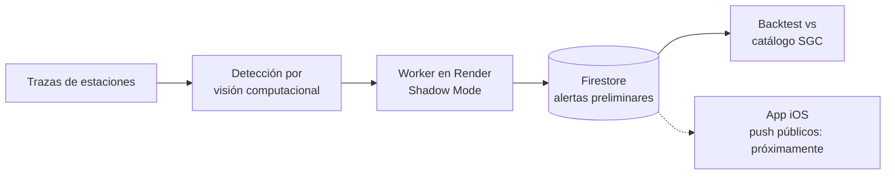

  

  
  
  

---

## Sobre mí

<table>
<tr>
<td width="60%" valign="top">

Desarrollo aplicaciones móviles en **Swift** y **Kotlin** y servicios backend en **Node.js**.

Mi proyecto principal es **SismoAlerta**: un sistema de alerta sísmica para Colombia que detecta eventos con **visión computacional sobre trazas de ondas** y valida cada alerta contra el catálogo oficial del **Servicio Geológico Colombiano (SGC)**.

Me interesa la ingeniería que se puede medir: backtesting, métricas y decisiones respaldadas por datos.

</td>
<td width="40%" valign="top">

| | |
|---|---|
| **Ubicación** | Colombia |
| **Enfoque** | Móvil · Backend · Datos |
| **Ahora** | Subir la precisión del detector |
| **Aprendiendo** | Arquitectura de software y cloud |

</td>
</tr>
</table>

---

## Caso de estudio: SismoAlerta

> Sistema de alerta sísmica para Colombia: app iOS, backend y worker de detección en producción. Código en repositorios privados; el detalle está en mi [portafolio](https://www.jeancarlo.space/es).

<table>
<tr>
<td width="33%" valign="top">

**Detección**

Visión computacional sobre trazas de ondas de estaciones sismológicas.

</td>
<td width="33%" valign="top">

**Validación**

Cada alerta se contrasta con el catálogo SGC, separando verdaderos positivos y falsos negativos.

</td>
<td width="33%" valign="top">

**Despliegue**

Worker en Render en *Shadow Mode*: registra alertas sin notificar, evitando falsas alarmas al público.

</td>
</tr>
</table>

**Estado:** en validación. El siguiente hito es aumentar la precisión antes de habilitar notificaciones push públicas.

---

## Stack

  

  
  
  
  
  
  

---

## Proyectos públicos

<table>
<tr>
<td align="center" width="50%">
  
   Proyecto universitario: simulación de una app bancaria móvil en Kotlin.
</td>
<td align="center" width="50%">
  
   Mi portafolio personal.
</td>
</tr>
</table>

---

## Contacto

  Abierto a colaboración en proyectos de alerta temprana, apps móviles y sistemas en tiempo real.  
  
  

