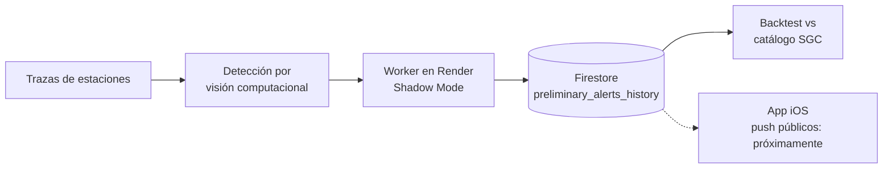

<h1 align="center">Jeancarlo</h1>

  Desarrollador de software · Apps móviles nativas y sistemas backend en tiempo real 
  Colombia

  
  
  

---

## Perfil

Desarrollo aplicaciones móviles en **Swift** y **Kotlin** y servicios backend en **Node.js**. Mi proyecto principal es **SismoAlerta**, un sistema de alerta sísmica para Colombia que detecta eventos mediante **visión computacional sobre trazas de ondas** de estaciones sismológicas y valida sus resultados contra el catálogo oficial del Servicio Geológico Colombiano (SGC).

Actualmente profundizo en arquitectura de software y despliegues en la nube.

---

## Proyecto principal: SismoAlerta

Sistema de alerta sísmica para Colombia: app iOS, backend y worker de detección en producción.

**Estado:** el detector opera en *Shadow Mode* (genera y registra alertas sin notificar al público). El objetivo actual es aumentar la precisión antes de habilitar notificaciones push.

**Enfoque de ingeniería**
- Validación cuantitativa: cada alerta se compara con el catálogo SGC, separando verdaderos positivos y falsos negativos para medir el detector con datos y no con impresiones.
- Despliegue en modo sombra para evaluar el sistema en producción sin exponer a usuarios a falsas alarmas.
- Historial persistente de alertas preliminares para auditoría y análisis posterior.

**Resultados del backtest** _(completa con tus cifras reales)_

| Métrica | Valor |
|---|---|
| Precisión | _XX %_ |
| Recall | _XX %_ |
| Periodo evaluado | _fecha – fecha_ |

**Repositorios:** [Backend](https://github.com/jeancarlo12/SismoAlerta-Backend) · [App iOS](https://github.com/jeancarlo12/SismoAlerta)

---

## Otros proyectos

| Proyecto | Descripción | Tecnologías |
|---|---|---|
| [LUKA](https://github.com/jeancarlo12/LUKA) | _Una línea: qué problema resuelve_ | Kotlin, Android |
| [Be-Master](https://github.com/jeancarlo12/Be-Master) | _Una línea: qué hace_ | _Stack_ |
| [Portafolio-Jeancarlo](https://github.com/jeancarlo12/Portafolio-Jeancarlo) | Portafolio personal | _Stack web_ |

---

## Stack

| Área | Tecnologías |
|---|---|
| Móvil | Swift (iOS) · Kotlin (Android) |
| Backend | Node.js · Firestore · Render |
| Calidad de datos | Backtesting propio, análisis con CSV |
| Herramientas | Git · GitHub · Integración de APIs |

  

---

Abierto a colaboración en proyectos de alerta temprana, apps móviles y sistemas en tiempo real.
